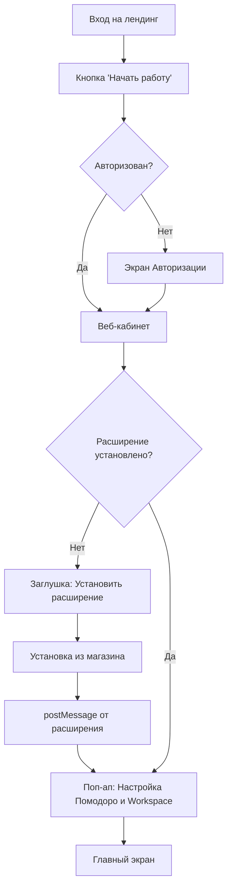
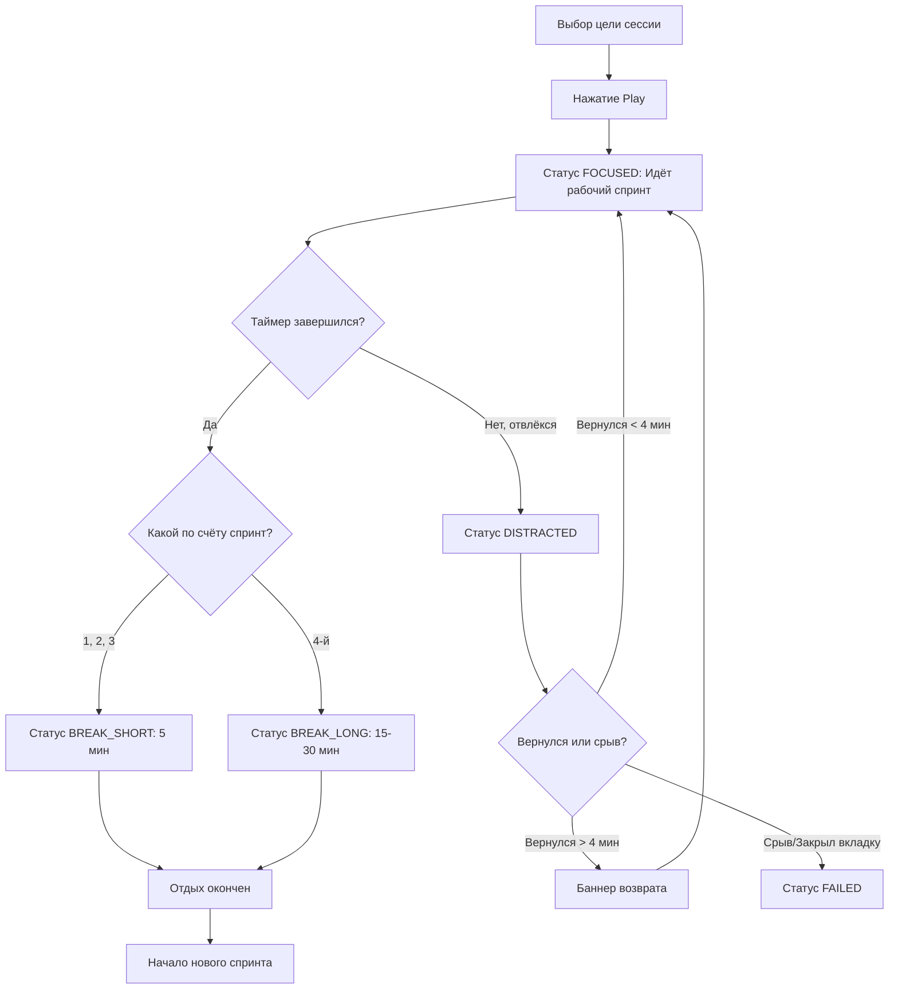
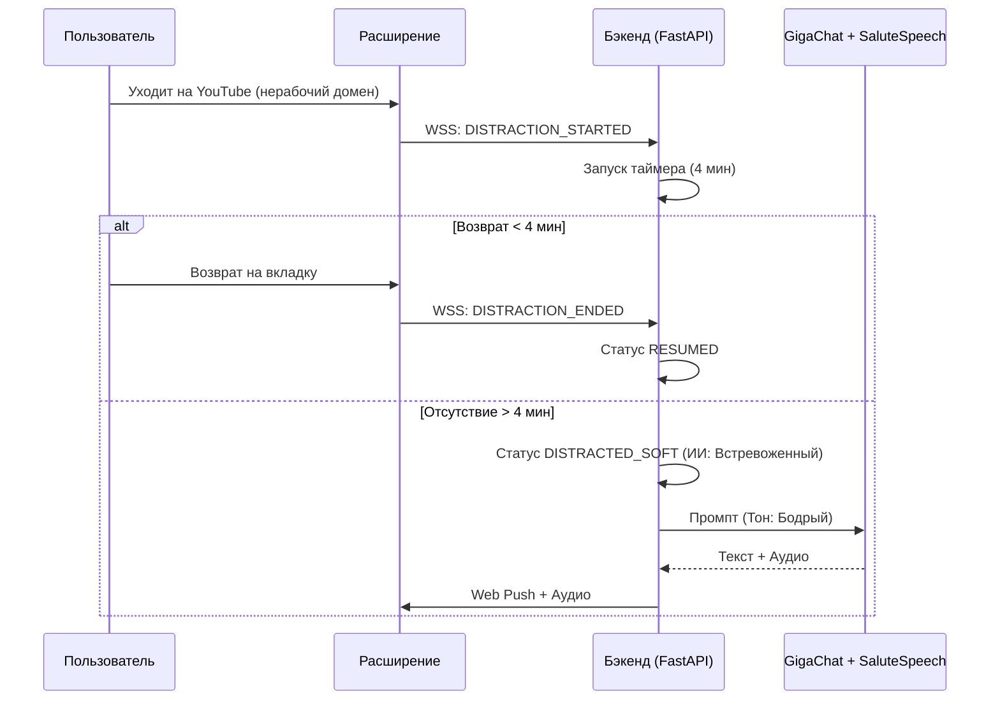

# Документ 2: User Flows и описание экранов Tomatoro (Конкурсная версия)

> **Статус:** Черновик системного аналитика v2. **Цель:** Зафиксировать пути пользователя и текстовое описание интерфейсов с учётом метода Помодоро, тарифов и геймификации.

## 1. User Flows (Пути пользователя)

### 1.1. Flow 1: Авторизация, Онбординг и Настройка сессий

### 1.2. Flow 2: Жизненный цикл сессии (Помодоро)

### 1.3. Flow 3: Эскалация при отвлечении (Тариф Стандартный)

---

## 2. Текстовое описание экранов (Wireframe-spec)

### 2.1. Лендинг (Главная страница)

- **Hero блок:** Заголовок «Томаторо — ИИ-напарник для фокусировки на работе». Анимированная фигурка помидора. Кнопка «Попробовать бесплатно».
- **Блок тарифов:** 2 карточки (Базовый: 0 руб, Стандартный: 300 руб/мес или 3000 Помидорок).

### 2.2. Экран Авторизации

- **Центральная карточка:** Кнопки OAuth (СберID, ВКонтакте, Яндекс ID). Поле Email/Телефон -> Кнопка «Получить код» -> Инпут для OTP.

### 2.3. Поп-ап настройки Рабочего пространства и Помодоро (при первом входе)

- **Заголовок:** «Настройте свой идеальный ритм работы».
- **Секция 1: Метод Помодоро (с подсказками):**
  - *Поле:* Длина рабочего спринта (мин). *Подсказка:* «Классика — 25 минут. Этого достаточно, чтобы погрузиться в задачу, но не перегореть. Если задача сложная — попробуйте 50 минут».
  - *Поле:* Длина короткого перерыва (мин). *Подсказка:* «Классика — 5 минут. Встаньте, разомнитесь, не открывайте соцсети».
  - *Поле:* Длина длинного перерыва (мин). *Подсказка:* «15-30 минут. Наступает после завершения серии спринтов».
  - *Поле:* Количество спринтов в серии (до длинного перерыва). *Подсказка:* «Обычно это 4 спринта (2 часа работы). После него — большой отдых».
- **Секция 2: Рабочее пространство:**
  - *Текст:* «Укажите домены, на которых вы работаете. Если вы уйдёте с них во время спринта, Томаторо решит, что вы отвлеклись».
  - *Поля ввода:* 3 текстовых инпута (пример: `github.com`, `figma.com`). `tomatoro.com` предзаполнен и неудаляем.
  - *Слайдер:* «Считать отвлечением через:» (от 1 до 10 минут, дефолт 4).
- **Кнопка:** «Сохранить и начать работу».

### 2.4. Главный экран (Веб-кабинет)

- **Left Sidebar (Меню):** Иконки: Таймер, Аналитика, Итоги дня, Профиль/Уровни, Настройки.
- **Top Bar:**
  - Слева: Текущий тариф (плашка: `[Базовый]` или `[Стандартный]`).
  - Справа: Текущий Сорт помидора (например, «Черри»), баланс Помидорок (иконка монетки + цифра), Стрик (огонёк + цифра дней).
  - Крайне справа: Аватарка юзера (при клике — выпадающее меню: «Настройки», «Оплата тарифа», «Выйти»).
- **Центральная зона (Разделена на 2 части):**
  - *Лево (60%):* Большой круговой таймер. Внутри — время. Под таймером поле «Цель спринта» (текстовое).
    - Кнопка управления: Play (Начать спринт) / Pause (Пауза) / Stop (Завершить досрочно — спрашивает «Вы уверены? Спринт будет провален»).
    - Индикатор серии: Четыре точки над таймером. Заполненная точка = завершённый спринт. Когда заполняются все 4 — начинается длинный перерыв.
    - *Во время перерыва:* Таймер меняет цвет на зелёный, кнопка «Пропустить перерыв».
  - *Право (40%):* Крупный персонаж Томаторо.
    - **[Базовый]:** Статичная картинка (Бодрый). При возврате с отвлечения здесь показывается текстовый баннер: «Вы вернулись! Ваша цель: [Текст]. Продолжаем?».
    - **[Стандартный]:** Анимация персонажа меняется в зависимости от статуса (Бодрый, Встревоженный, Грустный). При отвлечении здесь появляется текст реплик от ИИ (дублируется голосом).

### 2.5. Экран Аналитики

- **Переключатель периодов:** День / Неделя / Месяц.
- **[Базовый] и [Стандартный]:**
  - *Метрики (карточки):* Всего в фокусе (чч:мм), Завершено спринтов (шт), Срывов (шт), Время отвлечений (чч:мм).
  - *Графики:* Столбчатая диаграмма «Время фокуса по дням». Столбчатая диаграмма «Количество срывов по дням».
  - *Почему фиксируется:* Фокус — для ощущения прогресса. Срывы и время отвлечений — чтобы юзер видел свои «слабые» дни.
- **[Стандартный] (Дополнительно):**
  - *Блок ИИ-Паттернов:* Карточка с текстом от Томаторо: «Я заметил, что ты чаще всего срываешься после 15:00. Старайтесь делать самые сложные задачи утром».
  - *График:* Карта отвлечений по часам (Heatmap).

### 2.6. Экран Итогов дня

- **Триггер:** Вход после 18:00, нажатие кнопки «Завершить день» (на главном экране) или автоматическое завершение последнего спринта после 20:00.
- **Header:** «Итоги дня: [Дата]».
- **Блок сравнения:** План (из утреннего списка) vs Факт (задачи с галочками и потраченным временем).
- **Метрики:** Сколько фокус-часов, сколько спринтов собрано, сколько срывов.
- **[Базовый]:** Только графики и метрики.
- **[Стандартный]:** ИИ-Сводка от GigaChat (похвала, разбор срывов, совет на завтра).
- **Кнопка:** «Перенести невыполненное на завтра».
- **Кнопка:** «Завершить день» (блокирует таймер до следующего утра или ручного старта).

### 2.7. Экран Профиль и Геймификация (Обновлённый)

- **Верхний блок:** Аватар юзера, Имя, Текущий тариф.
- **Блок Привязанные аккаунты (Новый):**
  - *Заголовок:* «Способы входа».
  - *Список провайдеров с кнопками:*
    - Email: `[Привязан: user@mail.com]` / `[Привязать]`
    - Телефон: `[Привязан: +7XXX...]` / `[Привязать]`
    - СберID: `[Привязан]` (зелёная галочка) / `[Привязать]`
    - Яндекс ID: `[Привязан]` / `[Привязать]`
    - ВКонтакте ID: `[Привязан]` / `[Привязать]`
  - *Логика:* Юзер может привязать несколько способов входа к одному аккаунту. При нажатии «Привязать» открывается OAuth-окно провайдера.
- **Блок Геймификации:**
  - *Сорт помидора:* Крупная иконка текущего уровня (например, «Бычье сердце»).
  - *Прогресс-бар:* Полоса до следующего уровня. Текст: «До сорта "Оранжевый король" осталось 1500 FP».
  - *Стрик:* Календарь на месяц (зелёные дни — были сессии, красные — срывы/пропуски).
- **Блок Экономики:**
  - Баланс Помидорок (ПК). Кнопка «Как заработать?» (открывает тултип: +10 ПК за успешный спринт).
  - Кнопка «Потратить на подписку» -> Редирект на Экран Биллинга.

### 2.8. Экран Биллинга (Оплата и Тарифы)

- **Текущий тариф:** Крупная плашка. Если `[Базовый]`, плашка красная с кнопкой «Повысить до Стандартного».
- **Модалка/Секция выбора тарифа (При клике "Повысить"):**
  - Заголовок: «Открой ИИ-напарника».
  - Список фич Стандартного: Голос, Эмоции, Web Push, Память, Геймификация.
  - **Блок оплаты:**
    - Вкладка 1: «Оплатить рублями» (Сумма 300 ₽, кнопка «Перейти к ЮKassa»).
    - Вкладка 2: «Оплатить Помидорками» (Сумма 3000 ПК, текущий баланс. Кнопка «Списать и активировать». Если баланс < 3000, кнопка заблокирована: «Не хватает X Помидорок»).
- **История платежей:** Таблица (Дата, Сумма, Способ, Статус).

### 2.9. Экран Настроек

- **Секция Профиль:** Имя, Email, Телефон. Кнопка «Выйти из аккаунта» (красная).
- **Секция Таймер (Помодоро):** Редактирование длин спринтов и перерывов (как в онбординге, с подсказками).
- **Секция Рабочее пространство:** Редактирование 3-х доменов и ползунка времени фиксации отвлечения.
- **Секция Уведомления:**
  - **[Базовый]:** Тумблер «Текстовый баннер при возврате» (Вкл/Выкл).
  - **[Стандартный]:** Тумблеры: Web Push (Вкл/Выкл), Голосовые уведомления (Вкл/Выкл), Выбор голоса (Мужской/Женский).
- **Секция Расширение:** Статус (Активно/Неактивно), кнопка «Переустановить» (ссылка на магазин).

### 2.10. Интерфейс Браузерного расширения (Pop-up)

Расширение работает по принципу Pop-up (всплывающее окно при клике на иконку расширения в панели браузера). Интерфейс адаптируется под состояние авторизации и статус сессии.

**Состояние 1: Пользователь не авторизован**

- **Экран:** Логотип Tomatoro.
- **Текст:** «Войдите в аккаунт, чтобы я начал следить за фокусом».
- **Кнопка:** «Войти / Зарегистрироваться» (открывает новую вкладку с экраном авторизации веб-кабинета). Расширение получает токен только после успешного входа на сайте.

**Состояние 2: Пользователь авторизован, сессия не запущена**

- **Header:** Аватарка, Имя юзера. Плашка текущего тарифа (`[Базовый]` или `[Стандартный]`).
- **Центральная зона:**
  - Текстовое поле: «Цель спринта» (короткий инпут).
  - Кнопка: «Начать спринт (Play)».
- **Footer (Быстрые ссылки):**
  - «Открыть кабинет» (открывает `tomatoro.com` в новой вкладке).
  - «Тариф и оплата» (открывает экран биллинга в новой вкладке).
  - **Кнопка «Выйти»** (красная, очищает токен из локального хранилища расширения).

**Состояние 3: Сессия запущена (Статус FOCUSED)**

- **Header:** Аватарка, Имя, Тариф.
- **Центральная зона:**
  - Мини-таймер (круговой прогресс-бар с отсчётом времени).
  - Текст: «Цель: [Текст, введённый при старте]».
  - Кнопка: «Завершить вручную (Stop)». При клике спрашивает подтверждение: «Завершить спринт досрочно? Он будет провален».
- **Индикатор серии:** Четыре точки (как в веб-кабинете), показывающие прогресс до длинного перерыва.
- **Footer:** Те же быстрые ссылки (Открыть кабинет, Оплата, Выйти).

**Состояние 4: Идёт перерыв (Статус BREAK)**

- **Центральная зона:**
  - Мини-таймер (зелёного цвета, отсчёт перерыва).
  - Текст: «Отдыхайте! До следующего спринта [X] мин».
  - Кнопка: «Пропустить перерыв» (сразу начинает новый спринт, поле цели очищается).

**Состояние 5: Зафиксировано отвлечение (Статус DISTRACTED)**

- **Центральная зона:**
  - Иконка тревожного Томаторо.
  - Текст: «Вы отвлеклись! Вернитесь на рабочую вкладку».
  - *Если тариф Стандартный:* здесь же может отображаться текст последней сгенерированной ИИ-фразы (дублирует Web Push).
- **Кнопка:** «Вернуться к работе» (переключает браузер на вкладку Tomatoro).

**Настройки расширения:**

- Открываются по клику на шестерёнку в Pop-up.
- **Секция:** «Уведомления».
  - Тумблер: «Показывать Web Push при отвлечении».
  - Тумблер: «Проигрывать звук уведомления» (Для тарифа Стандартный, если юзер хочет слышать звук пуша, даже если вкладка Tomatoro активна и голос не сработал).

---

---

## Дополнение к Документу 2: Всплывающие окна сообщений (Web Push и Баннеры)

У нас существует два типа всплывающих окон:

1. **Системный Web Push (Web Notifications API)** — всплывает в углу экрана ОС, когда пользователь находится в другой вкладке или программе.
2. **In-Site Баннер** — всплывает поверх интерфейса веб-кабинета Tomatoro, когда пользователь вернулся на рабочую вкладку (или если он свернул браузер и развернул снова).

### 1. Тариф Базовый (Статичные сообщения)

**1.1. Системный Web Push**

- **Триггер:** Время отвлечения превысило порог (по умолчанию 4 минуты).
- **Визуал:** Статичная иконка Томаторо (Бодрый).
- **Текст:** «Вы отвлеклись! Ваша цель: [Текст цели сессии]. Вернитесь к работе!».
- **Кнопки:** «Вернуться» (перекидывает на вкладку Tomatoro).
- **Как закрыть:** Кнопка [X] в углу уведомления или клик мимо уведомления (зависит от ОС).
- **Что произойдёт при закрытии без возврата:** Уведомление исчезает. Бэкенд продолжает отсчитывать время. Если время спринта истечёт, пока юзер не вернулся, сессия перейдёт в статус `FAILED` (срыв).

**1.2. In-Site Баннер (При возвращении)**

- **Триггер:** Пользователь вернулся на рабочую вкладку после отвлечения > 4 минут.
- **Визуал:** Плашка внизу экрана. Картинка Томаторо (Бодрый).
- **Текст:** «Вы вернулись! Вы отсутствовали [X] мин. Ваша цель: [Текст]. Продолжаем?».
- **Кнопки:** «Продолжить» (закрывает баннер, статус `RESUMED`), «Честный перерыв» (закрывает баннер, статус `BREAK`, спринт засчитывается как проваленный).
- **Как закрыть:** Только кнопками действий. Кнопки [X] нет.
- **Что произойдёт при закрытии без возвращения:** Невозможно. Баннер блокирует интерфейс таймера (модальное окно). Пользователь должен сделать выбор.

---

### 2. Тариф Стандартный (ИИ-сообщения с эскалацией)

**2.1. Системный Web Push (Динамический)**

- **Триггер:** Отвлечение > 4 мин (уровень SOFT), > 8 мин (уровень SAD), > 12 мин (уровень ANGRY).
- **Визуал:** Иконка Томаторо меняется в зависимости от уровня (Встревоженный -> Грустный -> Обиженный).
- **Текст:** Генерируется GigaChat на основе цели сессии, времени отсутствия и паттернов.
  - *Пример (4 мин):* «Эй, абзацы сами себя не напишут! Возвращаемся?»
  - *Пример (8 мин):* «Я тут один скучаю, а ты там, кажется, нашёл что-то поинтереснее... Возвращайся, цель ждёт.»
- **Кнопки:** «Вернуться к работе».
- **Как закрыть:** Кнопка [X] или клик мимо.
- **Что произойдёт при закрытии без возврата:** Уведомление исчезает. Бэкенд засекает следующие 4 минуты. Если юзер не вернётся, придёт **новый** Web Push с усиленной эмоцией (Грустный -> Обиженный). Параллельно на бэкенде стримится аудио (TTS), которое попытается проиграться на вкладке Tomatoro, если она активна в фоне.

**2.2. In-Site Баннер (При возвращении)**

- **Триггер:** Пользователь вернулся на рабочую вкладку после ИИ-вмешательства.
- **Визуал:** Плашка внизу/в центре экрана. **Анимированная** иконка Томаторо, отражающая его текущее настроение (Встревоженный, Грустный или Обиженный — зависит от того, сколько минут юзер отсутствовал).
- **Текст:** Та же фраза, которую сгенерировал ИИ для последнего Web Push (или новая, если с момента Web Push прошло время). Дублируется голосом (TTS) при появлении баннера.
- **Кнопки:** «Возвращаюсь» (статус `RESUMED`, +30 FP), «Честный перерыв» (статус `BREAK`, спринт провален).
- **Как закрыть:** Только кнопками действий. Крестика [X] нет.
- **Что произойдёт при закрытии без возвращения:** Как и в базовом тарифе, баннер блокирует интерфейс. Если юзер снова уйдёт со вкладки, не нажав кнопку, через 4 минуты цикл ИИ-вмешательства запустится заново, и эмоция Томаторо станет более негативной (если он уже был Грустным, станет Обиженным).

---

### 3. Специальные всплывающие окна (Для всех тарифов)

**3.1. Модалка завершения спринта (Статус COMPLETED)**

- **Триггер:** Время рабочего спринта истекло.
- **Визуал:** Анимированный счастливый Томаторо (сияет, показывает большой палец).
- **Текст:** «Спринт засчитан! +50 Focus Points и +10 Помидорок. Пора отдохнуть [X] минут.».
- **Кнопки:** «Начать перерыв» (запускает таймер перерыва), «Пропустить перерыв» (сразу начинает новый спринт).

**3.2. Модалка срыва сессии (Статус FAILED)**

- **Триггер:** Пользователь нажал «Завершить вручную» и подтвердил, ИЛИ время спринта истекло, пока юзер отсутствовал.
- **Визуал:** Анимированный разочарованный Томаторо (плачет).
- **Текст:** «Спринт провален. Списываем 50 Focus Points. Но не сдавайся, завтра будет лучше!».
- **Кнопка:** «Понятно» (закрывает модалку, таймер сбрасывается в начальное состояние).

---

### Дополнения к Документу 2: User Flows и описание экранов

*Добавить новый раздел 3:*

## 3. Интерфейс Администратора (CRM на базе SQLAdmin)

Доступ к админ-панели осуществляется по отдельному URL: `tomatoro.com/admin`. Интерфейс генерируется автоматически на базе моделей SQLAlchemy (фреймворк SQLAdmin), что избавляет от написания отдельного фронтенда.

### 3.1. Экран Авторизации Администратора

- **Форма:** Email, Пароль.
- **Поле 2FA:** 6-значный код из приложения аутентификатора.
- **Защита:** Ограничение на 3 попытки входа с одного IP в минуту (Rate Limiting).

### 3.2. Дашборд (Главная страница)

- **Виджеты (Карточки):**
  - Активные пользователи сегодня (DAU).
  - Платящие подписчики (Стандартный).
  - Доход за сегодня / за месяц.
  - Завершено спринтов за сегодня / Сорвано спринтов.
- **График:** Линейная диаграмма DAU за последние 14 дней.

### 3.3. Раздел «Пользователи» (Users)

- **Таблица:** ID, Аватар, Имя, Email, Телефон, Тариф, Баланс Помидорок, Дата регистрации, Статус (Active/Banned).
- **Фильтры и Поиск:** По Email, Телефону, Тарифу.
- **Карточка редактирования (при клике на юзера):**
  - Редактирование полей (смена пароля, смена тарифа вручную).
  - Кнопка «Заблокировать» (устанавливает флаг `is_banned = True`, юзер выкидывается из сессии).
  - Кнопка «Пополнить Помидорки» (ручной ввод суммы для тестировщиков/блогеров).

### 3.4. Раздел «Платежи и Подписки» (Billing)

- **Таблица транзакций:** Дата, Юзер, Сумма, Метод (YooKassa / Помидорки), Статус (Pending / Succeeded / Refunded).
- **Действие:** При клике на транзакцию YooKassa со статусом `Succeeded` доступна кнопка «Сделать возврат» (вызывает API YooKassa).

### 3.5. Раздел «Промокоды» (Promo Codes)

- **Таблица:** Код, Тип (на 30 дней Стандартный), Лимит активаций, Сколько раз использовано.
- **Кнопка:** «Сгенерировать код» (создаёт случайный код, выдача доступа для 70 тестировщиков по требованиям конкурса Сбер500).

### 3.6. Раздел «Логи администратора» (Audit Logs)

- **Таблица:** Дата/Время, ID Админа, Действие (например, `UPDATE_USER_TARIFF` или `REFUND_PAYMENT`), Цель (ID юзера), Детали (старое/новое значение).

---

# ДОПОЛНЕНИЕ ОТ ГЛАВНОГО АГЕНТА (2026-09-09): синхронизация с финальными макетами и решениями №23–27

> Термины этого документа приведены к иерархии решения №27: **сессия → упразднена**;
> везде «спринт» (рабочий отрезок), «помодоро» (группа спринтов), «день». Где выше
> написано «сессия» — читать «спринт». Ниже — новые экраны и уточнения текстов,
> которых в wireframe-spec выше не было (по финальному макету TOMOTORO_UX_MAKET.html,
> «Заглушки v34», и browser extension_Maket.html).

## Д2-1. Навигация кабинета — уточнение сайдбара

Верхний тоггл Флоу 1 и «Иконки: Таймер, Аналитика…» в п. 2.4 заменить на фактический
набор вкладок макета: **Сегодня, Задачи, Аналитика, Профиль, Тарифы, Настройки,
Геймификация, Справка** (8 вкладок). «Итоги дня» — не вкладка, а экран по триггерам
(п. 2.6). Динамическое расширение рабочей зоны: на «Задачи», «Тарифы» и «Аналитике»
правая панель с Томаторо скрывается (советы дизайнера, п. 3) — это фронтенд-правило,
не отдельный экран.

## Д2-2. Новые экраны (описания для вёрстки)

### 2.11. Экран «Задачи» (трёхзонный)
- **Левая колонка — Бэклог (Задачи дня):** список задач, у каждой бейдж
  привязки к спринту в формате «П1 С2» (помодоро 1, спринт 2) или «Не назначено».
  Кнопка «+ Задача». Двойной клик по тексту — редактирование на месте (editTask).
  Перетаскивание/меню «Перенести в другой спринт».
- **Правая колонка — Структура дня (Помодоро):** карточки «Помодоро 1..N», в каждой
  «X из 4 спринтов» и список спринтов: номер, задача, статус-чипы **Успех / Частично /
  В фокусе / Пустой / Срыв**; «+ Спринт в помодоро»; «+ Добавить Помодоро в день».
- **Клики:** клик по задаче в бэклоге = назначить целью текущего спринта;
  клик по пустому спринту = выбрать задачу.
- **Кнопка «Архив»** открывает модалку архива задач (по датам; загрузка «Задачи за
  выбранную дату», переносы с вчера — «Вчерашняя задача N»).

### 2.12. Таймлайн дня (блок экрана «Сегодня», над таймером)
- Горизонтальная лента сегментов: 🍅 спринт / ☕ перерыв / 🛋️ длинный отдых.
- Состояния сегмента: завершён (заливка), частично, пропущен (перечёркнут),
  текущий (пульс), впереди (контур). Подписи при наведении: время начала/конца.
- Прокрутка мышью и колёсиком (подсказка «Тяните мышью или колесиком»).
- Кнопки «+ Помодоро» и «➕ Добавить» добавляют сегменты.
- Под лентой: карточка «Текущий спринт» (статус «В фокусе», время, кнопки ⏸ Пауза /
  ⏹ Завершить / 🏁 Завершить помодоро) и карточка «Текущий помодоро (Цикл N)»
  («Спринты в помодоро: X из 4 завершено», «Добавить спринт»).

### 2.13. Экран «Геймификация» (отдельная вкладка)
- Заголовок «Прокачивай свой уровень фокуса!», тултип «⚡ Как это работает?».
- Сорта помидоров: карточки уровней с порогами ОФ и множителем («Бонус: 3x»).
- Блок «🎁 Бонусы и награды»: что открывается на каждом уровне.
- Текущий прогресс до следующего сорта; история дня с начислениями
  («Спринт 2 завершен (+50 ⚡)», «Отвлечение 4 мин (возвращение)», «Перерыв (пропущен)»).

### 2.14. Экран «Справка» (отдельная вкладка)
- Разделы: «🍅 Метод Помодоро» (краткое обучение), «⚙️ Функции Tomatoro»,
  «💬 Контакты поддержки». Текстовые карточки, без интерактива.

### 2.15. Экран «Тарифы» — уточнения к п. 2.8
- На карточке текущего тарифа: «Действует до [дата] (осталось N дней)» и кнопка
  «Отменить подписку» (отключение автопродления, тариф действует до конца срока).
- Блок «Способы оплаты»: список маскированных карт («Visa **** 4242») с удалением
  и «+ Добавить новую карту» (токенизация ЮKassa,_cvC не храним).
- В тарифе Базовый к списку фич добавить: «Статистика по дням, неделям и датам»
  (решение №20); «Экспорт данных CSV» — обеим (№FR-21).

## Д2-3. Уточнения текстов существующих экранов

- **2.4 Главный экран:** цвет таймера при отвлечении — **горчичный** (`#F5B841`),
  НЕ красный (советы дизайнера п. 2; красный — только системные ошибки).
- **2.5 Аналитика:** добавить период «Квартал» в переключатель; добавить два графика:
  «Динамика фокуса и Индекс продуктивности» (факт — зубчатая линия, тренд — штриховая,
  подпись-обучение «Ты прогрессируешь, даже если были провалы!») и кольцевую
  «Распределение спринтов» (Успех/Частично/Срыв). У срывов — терракотовый/горчичный
  цвет, не красный. В блоке ИИ-паттернов — кнопка «Сбросить паттерны».
- **2.7 Профиль:** верхний блок показывает строку «Уровень 3: Бычье сердце • 4500 ⚡ ОФ •
  1500 🍅 ПК». Блок «Контакты и безопасность» содержит и «Изменить имя».
- **2.9 Настройки:** добавить кнопки «Сбросить к рекомендованным» (все параметры — к
  дефолтам), «Экспорт данных» (CSV: вся история сессий и задач), «Удалить аккаунт
  навсегда» с предупреждением 152-ФЗ (уже в Документе 7), «Сбросить паттерны».
- **2.10 Расширение:** в состоянии 3 добавить кнопку **⏸ Пауза** (решение FR-20);
  в состоянии 5 — обратный отсчёт «Осталось [X]» до следующей эскалации и реплика
  Томаторо; в состоянии 2 поле цели подписать «Чему посвятим спринт?»; в footer
  плашка тарифа: «Стандарт».
- **Push-макеты (раздел «Сравнение тарифов»):** постер показывает «мягкое напоминание
  на 1–3 мин» у Стандартного — **не реализуем** (решение №23: до порога тишина).
  В вёрстке пометить как «отменено».

## Д2-4. User Flows — дополнения

- **Flow 2:** добавить ветку Пауза: `focused --pause--> paused --resume--> focused`
  (отвлечения в паузе не фиксируются, расширение приостановлено).
- **Новый Flow 4 — Перенос задачи:** Бэклог → выбрать задачу → «Перенести в другой
  спринт» (в пределах дня или на завтра) → обновление бейджа «ПX СY» → событие в
  журнал дня.
- **Новый Flow 5 — День без срывов:** последний спринт дня COMPLETED → все помодоро
  дня без FAILED → бэкенд начисляет бонус ПК (№26) → модалка «Идеальный день!».
- **Новый Flow 6 — Подбодрить Томаторо:** статус FAILED → у персонажа кнопка
  «Подбодрить (−100 ОФ)» → списание → настроение «Бодрый» → реплика благодарности.
