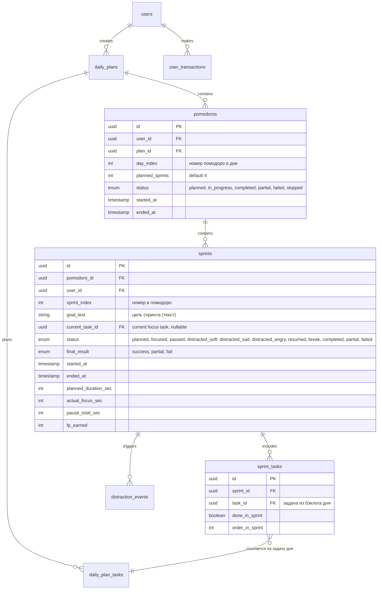

# Документ 4: Модель данных (ER-диаграмма) Tomatoro (Конкурсная версия)

> **Статус:** Черновик системного аналитика.
> **Цель:** Описать структуру базы данных (PostgreSQL/Supabase), сущности, связи и поля для разработки MVP.

## 1. ER-диаграмма (Mermaid)

```mermaid
erDiagram
    users ||--o| user_settings : has
    users ||--o{ user_identities : has
    users ||--o{ daily_plans : creates
    users ||--o{ sessions : runs
    users ||--o{ transactions : makes
    users ||--o{ user_patterns : forms
    users ||--o{ promo_redemptions : uses

    daily_plans ||--o{ daily_plan_tasks : contains
    sessions ||--o{ distraction_events : triggers

    %% Admin links
    users ||--o{ audit_logs : "admin edits"
    transactions }o--|| promo_codes : "may use"

    users {
        uuid id PK
        string email
        string phone
        string password_hash
        enum role "user, admin, support"
        boolean is_banned
        string totp_secret "for admins"
        enum subscription_tier "base, standard"
        timestamp subscription_expire_date
        int focus_points
        int tomato_coins
        enum current_ai_mood "cheerful, anxious, sad, angry, disappointed, proud"
        timestamp last_active_date
        timestamp created_at
    }

    user_settings {
        uuid user_id PK, FK
        int work_sprint_min "default 25"
        int short_break_min "default 5"
        int long_break_min "default 15"
        int sprints_per_series "default 4"
        int distraction_threshold_min "default 4"
        text[] allowed_domains "max 3 + tomatoro.com"
        boolean web_push_enabled
        boolean voice_enabled
        enum tts_voice "male, female"
    }

    user_identities {
        uuid id PK
        uuid user_id FK
        string provider "email, phone, sber, yandex, vk"
        string provider_user_id
    }

    sessions {
        uuid id PK
        uuid user_id FK
        string goal_text
        enum status "focused, distracted_soft, distracted_sad, distracted_angry, resumed, break, completed, failed"
        timestamp started_at
        timestamp ended_at
        int planned_duration_sec
        int actual_focus_sec
        int focus_points_earned
        int tomato_coins_earned
    }

    distraction_events {
        uuid id PK
        uuid session_id FK
        timestamp started_at
        timestamp ended_at
        int duration_sec
        enum distraction_level "soft, sad, angry"
        string ai_message_text
    }

    daily_plans {
        uuid id PK
        uuid user_id FK
        date plan_date
        boolean is_completed
    }

    daily_plan_tasks {
        uuid id PK
        uuid plan_id FK
        string task_text
        boolean is_completed
        int spent_time_sec
    }

    transactions {
        uuid id PK
        uuid user_id FK
        int amount
        enum currency "rub, coin"
        enum payment_method "yookassa, internal"
        enum status "pending, succeeded, refunded, failed"
        string yookassa_payment_id
        uuid promo_code_id FK
        timestamp created_at
    }

    user_patterns {
        uuid id PK
        uuid user_id FK
        string pattern_type "e.g., afternoon_fail"
        string pattern_description
        boolean is_active
        timestamp created_at
    }

    promo_codes {
        uuid id PK
        string code
        enum discount_type "standard_30_days"
        int max_activations
        int used_activations
        timestamp expires_at
    }

    promo_redemptions {
        uuid id PK
        uuid promo_code_id FK
        uuid user_id FK
        timestamp redeemed_at
    }

    audit_logs {
        uuid id PK
        uuid admin_id FK
        string action_type
        uuid target_user_id
        jsonb details
        timestamp created_at
    }
```



---

## 2. Спецификация таблиц (PostgreSQL)

### 2.1. Таблица `users` (Пользователи)

Основная таблица профилей. Объединяет обычных юзеров и администраторов.

- **id (UUID, PK):** Уникальный идентификатор.
- **email (String, Nullable):** Email (уникален, если заполнен).
- **phone (String, Nullable):** Телефон (уникален, если заполнен).
- **password_hash (String, Nullable):** Хеш пароля (через passlib/bcrypt). Null, если вход только через OAuth.
- **role (Enum):** `user` (по умолчанию), `admin`, `support`.
- **is_banned (Boolean):** Флаг блокировки. Если True — бэкенд отклоняет запросы.
- **totp_secret (String, Nullable):** Секретный ключ 2FA (только для admin/support).
- **subscription_tier (Enum):** `base` или `standard`.
- **subscription_expire_date (Timestamp):** Дата окончания подписки. Если меньше текущей даты — тариф `base`.
- **focus_points (Integer):** Балл фокуса (FP). Не может быть меньше 0.
- **tomato_coins (Integer):** Баланс внутренней валюты (ПК).
- **current_ai_mood (Enum):** Текущее настроение ИИ (`cheerful`, `anxious`, `sad`, `angry`, `disappointed`, `proud`). Сбрасывается Cron-джобой.
- **last_active_date (Date):** Дата последней активности (для расчёта суточного штрафа -20 FP).
- **created_at (Timestamp):** Дата регистрации.

### 2.2. Таблица `user_settings` (Настройки)

Связь 1:1 с `users`. Хранит настройки Помодоро и Workspace.

- **user_id (UUID, PK, FK):** Ссылка на `users`.
- **work_sprint_min (Integer):** Длина рабочего спринта (дефолт 25).
- **short_break_min (Integer):** Длина короткого перерыва (дефолт 5).
- **long_break_min (Integer):** Длина длинного перерыва (дефолт 15).
- **sprints_per_series (Integer):** Количество спринтов до длинного перерыва (дефолт 4).
- **distraction_threshold_min (Integer):** Порог фиксации отвлечения (1-10, дефолт 4).
- **allowed_domains (Text[]):** Массив из 3-х доменов. В приложении всегда добавляется `tomatoro.com`.
- **web_push_enabled (Boolean):** Включены ли системные пуши.
- **voice_enabled (Boolean):** Включён ли голос TTS.
- **tts_voice (Enum):** `male` или `female`.

### 2.3. Таблица `user_identities` (Привязанные аккаунты)

Для мульти-авторизации (Сбер, ВК, Яндекс, Телефон, Email к одному аккаунту).

- **id (UUID, PK).**
- **user_id (UUID, FK):** Ссылка на `users`.
- **provider (String):** Тип провайдера (`email`, `phone`, `sber`, `yandex`, `vk`).
- **provider_user_id (String):** Уникальный ID пользователя на стороне провайдера.

### 2.4. Таблица `sessions` (Сессии Помодоро)

Лог жизненного цикла спринта.

- **id (UUID, PK).**
- **user_id (UUID, FK).**
- **goal_text (String):** Цель текущего спринта.
- **status (Enum):** `focused`, `distracted_soft`, `distracted_sad`, `distracted_angry`, `resumed`, `break`, `completed`, `failed`.
- **started_at (Timestamp).**
- **ended_at (Timestamp).**
- **planned_duration_sec (Integer):** Запланированное время (например, 1500 сек для 25 мин).
- **actual_focus_sec (Integer):** Реальное время в фокусе (минус отвлечения).
- **focus_points_earned (Integer):** Начисленные/списанные FP (+50, +30, -50).
- **tomato_coins_earned (Integer):** Начисленные ПК (+10).

### 2.5. Таблица `distraction_events` (События отвлечения)

Логирует каждое отвлечение для ИИ-памяти и аналитики.

- **id (UUID, PK).**
- **session_id (UUID, FK).**
- **started_at (Timestamp):** Когда ушёл.
- **ended_at (Timestamp):** Когда вернулся.
- **duration_sec (Integer):** Длительность.
- **distraction_level (Enum):** `soft`, `sad`, `angry` (зависит от времени отсутствия).
- **ai_message_text (String):** Текст, сгенерированный GigaChat (сохраняется для истории и дебага).

### 2.6. Таблицы `daily_plans` и `daily_plan_tasks` (Утренний план)

- **daily_plans:** `id`, `user_id`, `plan_date`, `is_completed`.
- **daily_plan_tasks:** `id`, `plan_id`, `task_text`, `is_completed`, `spent_time_sec`.

### 2.7. Таблица `transactions` (Платежи)

- **id (UUID, PK).**
- **user_id (UUID, FK).**
- **amount (Integer):** Сумма (300 для рублей, 3000 для монет).
- **currency (Enum):** `rub`, `coin`.
- **payment_method (Enum):** `yookassa`, `internal`.
- **status (Enum):** `pending`, `succeeded`, `refunded`, `failed`.
- **yookassa_payment_id (String, Nullable):** ID от ЮKassa для возвратов.
- **promo_code_id (UUID, FK, Nullable):** Если активирован промокод.

### 2.8. Таблица `user_patterns` (Память-лайт)

Формируется Cron-джобой на основе `distraction_events`.

- **id (UUID, PK).**
- **user_id (UUID, FK).**
- **pattern_type (String):** Например, `afternoon_fail`.
- **pattern_description (String):** Человекочитаемое описание ("Слипаешься после 15:00").
- **is_active (Boolean):** Актуален ли паттерн (может устареть).
- **created_at (Timestamp).**

### 2.9. Таблицы `promo_codes` и `promo_redemptions` (Промокоды)

Для выдачи тестового доступа (требование Сбер500).

- **promo_codes:** `id`, `code`, `discount_type` (пока только `standard_30_days`), `max_activations`, `used_activations`, `expires_at`.
- **promo_redemptions:** `id`, `promo_code_id`, `user_id`, `redeemed_at`. (Связь кто и когда использовал код).

### 2.10. Таблица `audit_logs` (Логи Администратора)

- **id (UUID, PK).**
- **admin_id (UUID, FK):** Кто совершил действие.
- **action_type (String):** Например, `UPDATE_TARIFF`, `REFUND_PAYMENT`, `BAN_USER`.
- **target_user_id (UUID):** Над кем совершили.
- **details (JSONB):** Детали (например, `{"old_tier": "base", "new_tier": "standard"}`).
- **created_at (Timestamp).**

---

## 3. Стратегия работы с БД и индексами

1. **Индексы (B-Tree):** 
   - `users(email)`, `users(phone)` — для быстрого поиска при логине.
   - `sessions(user_id, started_at)` — для построения аналитики и паттернов.
   - `user_identities(provider, provider_user_id)` — для быстрой OAuth-авторизации.
2. **Триггеры (Supabase / PL/pgSQL):**
   - При вставке новой записи в `users` автоматически создаётся запись в `user_settings` со значениями по умолчанию.
3. **Безопасность (RLS - Row Level Security):** 
   - В Supabase включается RLS. Пользователь может читать и обновлять только строки в `users`, `user_settings`, `sessions`, где `user_id = auth.uid()`.
   - Доступ к `transactions`, `promo_redemptions`, `audit_logs` на чтение только через FastAPI (с проверкой прав), а не напрямую из клиента.


---

# ДОПОЛНЕНИЕ ОТ ГЛАВНОГО АГЕНТА (2026-09-09): синхронизация с макетами и решениями №23–27

> Решение №27 упраздняет сущность `sessions`. Ниже — новые и изменённые сущности.
> Порядок внедрения: сначала заменить `sessions` на связку `sprints`/`pomodoros`,
> затем добавить новые таблицы. Изменения согласованны с дополнениями к Документам 1, 2, 5, 6.

## Д4-1. Замена `sessions` → `sprints` + `pomodoros` (решение №27)



Ключевые правила:
- `sprints.goal_text` дублируется из задачи или вводится вручную; `current_task_id` —
  задача, выбранная целью спринта (клик по задаче в бэклоге).
- Перенос задачи в другой спринт = изменение/создание строки `sprint_tasks`
  (+ событие в журнал дня). Задачи дня живут в `daily_plan_tasks` (бэклог), спринты
  ссылаются на них.
- Статус `paused` (FR-20): время паузы копится в `pause_total_sec`; отвлечения
  в паузе не фиксируются; ИИ не активен.
- `final_result`: `success` (COMPLETED), `partial` (завершён с возвращением/паузами),
  `fail` (FAILED). Используется в «Распределении спринтов» и условии «день без срывов».
- Помодоро: короткий перерыв между спринтами внутри помодоро, длинный перерыв — после
  `pomodoros`; сегменты таймлайна дня строятся из `sprints` + перерывов
  (таблица перерывов не нужна: перерыв = пауза между спринтами с типом по позиции).

## Д4-2. Новые таблицы

### `user_transactions` (переименованная/расширенная `transactions`)
Добавить: `enum kind` = `subscription`, `coins_purchase`, `coins_for_day`,
`encourage_ai`, `refund`; `int coins_spent`; `int fp_spent`; `int card_token_id FK, nullable`.

### `payment_cards` (FR-22)
```
id PK, user_id FK, brand ("visa","mastercard","mir"),
last4 string, yk_card_token string (токен ЮKassa, не PAN), is_default bool, created_at
```

### `mood_boosts` («Подбодрить Томаторо», №26)
```
id PK, user_id FK, sprint_id FK nullable, fp_spent int, created_at
```
Логируем каждую покупку настроения для аналитики повторных срывов.

### `daily_bonuses` (Помидорки за идеальный день, №26)
```
id PK, user_id FK, date bonus_date, coins_granted int, sprints_total int,
sprints_failed int (всегда 0 при выплате), created_at
```
Уникальный индекс `(user_id, bonus_date)` — бонус не более одного в день.

### `level_config` (множители уровней, №26 / FR-«Бонус 3x»)
```
level int PK, name string, fp_threshold int, fp_multiplier numeric,
```
Эталонные значения (предложение, требует утверждения): 1/Черри/0/1.0; 2/Жёлтая ракета/
500/1.2; 3/Бычье сердце/1500/1.5; 4/Оранжевый король/3000/2.0; 5/Помидор-гигант/6000/3.0.

### `export_jobs` (Экспорт CSV, FR-21) — упрощённо
```
id PK, user_id FK, requested_at, completed_at, file_path nullable, status enum
```
Генерируется Celery-задачей, файл выдаётся ссылкой с ограниченным сроком жизни.
Альтернатива для MVP: синхронная выгрузка на лету без таблицы (решить на разработке).

## Д4-3. Изменения существующих таблиц

- `users`: добавить `bool auto_renew = true` (автопродление, FR-22 «Отменить подписку»).
- `user_patterns`: ничего не меняется; кнопка «Сбросить паттерны» = `UPDATE ... SET
  is_active=false WHERE user_id=...` (мягкий сброс, история сохраняется).
- `user_settings`: ничего не меняется; кнопка «Сбросить к рекомендованным» = запись
  дефолтов во все поля (front-end confirm).
- `daily_plans`: добавить `uuid backlog_order jsonb nullable` — порядок задач бэклога
  (drag&drop) и `date carried_from nullable` (день-источник переноса).
- `distraction_events`: добавить `uuid sprint_id FK` (замена session_id);
  `int escalations_sent` (сколько пушей/эскалаций отправлено в это отвлечение).
- `sessions`/`focus_points_earned`/`tomato_coins_earned` — удалить вместе с таблицей;
  начисления живут в `sprints.fp_earned` и `daily_bonuses`/`user_transactions`.

## Д4-4. Индексы и триггеры — дополнения

- `sprints(pomodoro_id, sprint_index)` unique; `pomodoros(plan_id, day_index)` unique.
- `daily_bonuses(user_id, bonus_date)` unique.
- Триггер на завершение спринта: при `final_result != null` пересчитать агрегаты
  помодоро (`completed/partial/failed`) и пометить `pomodoros.status`.
- Cron-агрегация паттернов (Док. 6, п.6) — теперь по `distraction_events` c join на
  `sprints` (у спринта есть время и статус; логика отбора не меняется).
