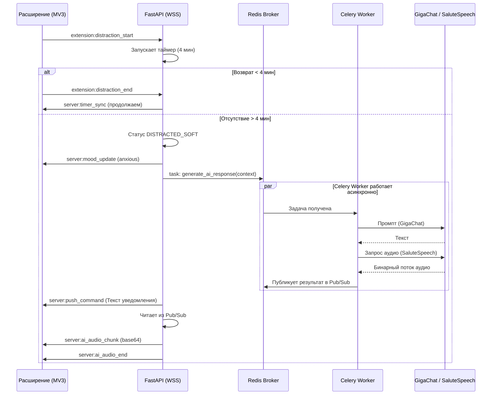

---

# Документ 5: API и Потоки данных Tomatoro (Конкурсная версия)

> **Статус:** Черновик системного аналитика.
> **Цель:** Определить контракты REST API и WebSocket-событий для фронтенда, расширения и внешних сервисов.

## 1. REST API Контракты (FastAPI)

Базовый URL: `https://api.tomatoro.com/api/v1`
Авторизация: `Authorization: Bearer <JWT>` (кроме OAuth-инициации и Webhook'ов).

### 1.1. Модуль Auth & Users

| Метод  | Эндпоинт                          | Описание                                | Тело запроса / Ответ                                                                    |
| ------ | --------------------------------- | --------------------------------------- | --------------------------------------------------------------------------------------- |
| `POST` | `/auth/oauth/{provider}`          | Вход через Сбер/VK/Яндекс.              | **Req:** `{ "code": "..." }` **Res:** `{ "access_token": "...", "user": {...} }`     |
| `POST` | `/auth/otp/send`                  | Запрос OTP-кода на телефон/email.       | **Req:** `{ "contact": "user@mail.com" }` **Res:** `204 No Content`                  |
| `POST` | `/auth/otp/verify`                | Проверка OTP.                           | **Req:** `{ "contact": "...", "code": "1234" }` **Res:** `{ "access_token": "..." }` |
| `GET`  | `/users/me`                       | Профиль пользователя.                   | **Res:** `{ "id": "...", "tier": "standard", "focus_points": 1500, ... }`               |
| `PUT`  | `/users/me/settings`              | Обновление настроек (Помодоро, домены). | **Req:** `{ "work_sprint_min": 50, "allowed_domains": ["github.com"] }`                 |
| `POST` | `/users/me/identities/{provider}` | Привязка нового ID (Сбер/VK/Яндекс).    | **Res:** `200 OK`                                                                       |

### 1.2. Модуль Sessions & Analytics

| Метод   | Эндпоинт              | Описание                             | Тело запроса / Ответ                                                                                        |
| ------- | --------------------- | ------------------------------------ | ----------------------------------------------------------------------------------------------------------- |
| `POST`  | `/sessions`           | Создание сессии (Спринта).           | **Req:** `{ "goal_text": "Написать 3 абзаца" }` **Res:** `{ "session_id": "uuid", "status": "focused" }` |
| `PATCH` | `/sessions/{id}`      | Ручное завершение или статус FAILED. | **Req:** `{ "action": "stop_manually" }`                                                                    |
| `GET`   | `/analytics`          | Получение данных для графиков.       | **Query:** `?period=week` **Res:** `{ "focus_time_sec": 36000, "fails_count": 5, ... }`                  |
| `GET`   | `/daily-plan`         | Получение утреннего плана.           | **Res:** `{ "tasks": ["Задача 1", "Задача 2"] }`                                                            |
| `POST`  | `/daily-plan`         | Сохранение утреннего плана.          | **Req:** `{ "tasks": ["Задача 1", "Задача 2"] }`                                                            |
| `POST`  | `/daily-plan/end-day` | Завершение дня (триггер Итогов).     | **Res:** `{ "ai_summary": "Текст от GigaChat..." }`                                                         |

### 1.3. Модуль Billing

| Метод  | Эндпоинт                    | Описание                             | Тело запроса / Ответ                                                                         |
| ------ | --------------------------- | ------------------------------------ | -------------------------------------------------------------------------------------------- |
| `POST` | `/billing/pay`              | Оплата рублями (YooKassa).           | **Req:** `{ "amount": 300 }` **Res:** `{ "confirmation_url": "https://yoomoney.ru/..." }` |
| `POST` | `/billing/pay-coins`        | Оплата Помидорками.                  | **Req:** `{ "amount": 3000 }` **Res:** `{ "status": "succeeded" }`                        |
| `POST` | `/billing/webhook/yookassa` | Webhook от ЮKassa (без авторизации). | **Req:** YooKassa standard payload. **Res:** `200 OK`                                        |
| `POST` | `/billing/promo`            | Активация промокода.                 | **Req:** `{ "code": "SBER500" }`                                                             |

---

## 2. WebSocket (WSS) Контракты

WSS используется для реал-тайм синхронизации Веб-кабинета (Next.js) и Браузерного расширения (WXT) с бэкендом.
URL: `wss://api.tomatoro.com/ws?token=<JWT>`

### 2.1. Клиент -> Сервер (Events)

| Событие                       | Отправитель | Payload                                          | Описание                                          |
| ----------------------------- | ----------- | ------------------------------------------------ | ------------------------------------------------- |
| `client:session_start`        | Веб-кабинет | `{ "session_id": "uuid" }`                       | Кабинет сообщает, что юзер нажал Play.            |
| `extension:distraction_start` | Расширение  | `{ "session_id": "uuid", "url": "youtube.com" }` | Расширение зафиксировало уход на нерабочий домен. |
| `extension:distraction_end`   | Расширение  | `{ "session_id": "uuid" }`                       | Юзер вернулся на рабочую вкладку.                 |
| `client:resume_session`       | Веб-кабинет | `{ "session_id": "uuid", "choice": "resume" }`   | Юзер нажал "Продолжить" в баннере возврата.       |
| `client:take_break`           | Веб-кабинет | `{ "session_id": "uuid" }`                       | Юзер нажал "Честный перерыв".                     |

### 2.2. Сервер -> Клиент (Events)

| Событие                    | Получатель  | Payload                                                          | Описание                                            |
| -------------------------- | ----------- | ---------------------------------------------------------------- | --------------------------------------------------- |
| `server:timer_sync`        | Оба         | `{ "session_id": "uuid", "time_left_sec": 1200 }`                | Серверная синхронизация таймера (раз в 30 сек).     |
| `server:mood_update`       | Веб-кабинет | `{ "mood": "anxious" }`                                          | Команда фронтенду сменить анимацию Томаторо.        |
| `server:show_banner`       | Веб-кабинет | `{ "text": "Вы вернулись!...", "buttons": ["resume", "break"] }` | Показ In-Site баннера.                              |
| `server:push_command`      | Расширение  | `{ "title": "Томаторо", "body": "Эй, абзацы не напишут себя!" }` | Команда расширению показать `chrome.notifications`. |
| `server:ai_audio_chunk`    | Веб-кабинет | `{ "chunk": "base64_audio_data" }`                               | Стриминг аудио (TTS) от Celery Worker.              |
| `server:ai_audio_end`      | Веб-кабинет | `{ "session_id": "uuid" }`                                       | Сигнал об окончании аудио-потока.                   |
| `server:session_completed` | Оба         | `{ "fp_earned": 50, "coins_earned": 10 }`                        | Спринт успешно завершён.                            |
| `server:session_failed`    | Оба         | `{ "fp_lost": 50 }`                                              | Спринт провален.                                    |

---

## 3. Потоки данных (Data Flows)

### 3.1. Flow: Эскалация при отвлечении (Тариф Стандартный)

Описывает асинхронное взаимодействие при отвлечении > 4 минут.

### 3.2. Flow: Оплата через YooKassa

1. **Кабинет** отправляет `POST /api/v1/billing/pay`.
2. **FastAPI** через SDK `yookassa` создаёт платёж, получает `confirmation_url`.
3. **Кабинет** редиректит юзера на `confirmation_url` (ЮKassa).
4. Юзер оплачивает. ЮKassa шлёт **Webhook** `POST /api/v1/billing/webhook/yookassa` на FastAPI.
5. **FastAPI** проверяет подпись Webhook'а, обновляет статус в БД (`transactions.status = succeeded`).
6. **FastAPI** обновляет `users.subscription_tier = standard` и `subscription_expire_date += 30 дней`.
7. При следующем запросе `GET /users/me` кабинет видит активный Стандартный тариф.

### 3.3. Flow: Web Push регистрация

1. При установке расширение регистрируется в Push-сервисе браузера (FCM для Chrome).
2. Расширение отправляет endpoint на бэкенд: `POST /api/v1/users/me/push-endpoint`.
3. Бэкенд сохраняет endpoint в таблице `user_settings`.
4. При срабатывании `server:push_command` бэкенд использует `pywebpush` для прямой отправки пуша в ОС, минуя WSS (если браузер/расширение неактивно).

---

## 4. Обработка ошибок (Fallback логика)

- **Таймаут GigaChat (> 5 сек):** Celery Worker перехватывает исключение, формирует статичную фразу из словаря (fallback) и отправляет её в TTS. Юзер не видит ошибку, просто получает менее креативное сообщение.
- **Таймаут SaluteSpeech:** Возвращается только текстовое сообщение (отображается в Web Push и In-Site баннере без аудио).
- **Обрыв WSS соединения:** Расширение и Кабинет реализуют экспоненциальный backoff для переподключения. Если расширение потеряло связь, но таймер на бэкенде идёт, бэкенд продолжит слать пуши через `pywebpush`.

---

# ДОПОЛНЕНИЕ ОТ ГЛАВНОГО АГЕНТА (2026-09-09): синхронизация с макетами и решениями №23–27

> Замена терминов: «session_id» во всех контрактах выше → «sprint_id» (решение №27).
> Ниже — новые эндпоинты, WSS-события и потоки, которых нет в базовой части.

## Д5-1. Новые REST эндпоинты

### Модуль «День и задачи» (иерархия №27)

| Метод | Эндпоинт | Описание | Тело / Ответ |
|---|---|---|---|
| `GET` | `/day` | Полное состояние дня: бэклог, помодоро со спринтами, таймлайн | Res: `{ "date": "...", "backlog": [...], "pomodoros": [{ "id", "day_index", "status", "sprints": [...] }], "timeline": [...] }` |
| `POST` | `/day/pomodoros` | Добавить помодоро в день | Req: `{ "planned_sprints": 4 }` |
| `POST` | `/pomodoros/{id}/sprints` | Добавить спринт в помодоро | Res: `{ "sprint_id": "uuid", "sprint_index": 3 }` |
| `POST` | `/sprints/{id}/tasks` | Привязать задачу к спринту (клик по задаче = цель спринта) | Req: `{ "task_id": "uuid" }` |
| `PATCH` | `/sprints/{id}/move-task` | Перенести задачу в другой спринт (FR-16) | Req: `{ "task_id": "uuid", "target_sprint_id": "uuid" }` |
| `PATCH` | `/sprints/{id}/pause` | Пауза спринта (FR-20) | Res: `{ "status": "paused" }` |
| `PATCH` | `/sprints/{id}/status` | Ручная отметка статуса спринта (Успех/Частично/Срыв — чипы макета) | Req: `{ "final_result": "partial" }` |
| `GET` | `/archive?date=` | Архив задач за дату (модалка) | Res: `{ "tasks": [...], "carried_from": "..." }` |

### Модуль «Аналитика» (расширение базового `/analytics`)

| Метод | Эндпоинт | Описание |
|---|---|---|
| `GET` | `/analytics/focus-dynamics?period=quarter` | Данные графика «Динамика фокуса»: ряд факта по периодам + рассчитанный тренд (линейная регрессия) для штриховой линии (FR-19) |
| `GET` | `/analytics/sprint-distribution?period=` | Кольцевая «Распределение спринтов»: `{ "success": 12, "partial": 3, "fail": 3 }` (FR-18) |
| `GET` | `/analytics/heatmap?period=` | Карта отвлечений по часам: матрица 7×24 счётчиков |

### Модуль «Профиль, тарифы, приватность»

| Метод | Эндпоинт | Описание | Тело |
|---|---|---|---|
| `GET` | `/profile/summary` | Строка профиля «Уровень 3: Бычье сердце • 4500 ОФ • 1500 ПК» | Res: уровень, ОФ, ПК, множитель |
| `POST` | `/billing/cards` | Привязка карты через токенизацию ЮKassa (FR-22) | Res: `{ "card_id", "brand", "last4" }` |
| `DELETE` | `/billing/cards/{id}` | Удалить карту | |
| `POST` | `/subscription/cancel-autorenew` | Отменить автопродление (FR-22) | — тариф действует до конца срока |
| `POST` | `/subscription/pay-partial` | Частичная оплата ПК+рубли (FR-26) | Req: `{ "coins": 1500, "rub": 150 }` |
| `POST` | `/gamification/encourage` | «Подбодрить Томаторо»: списать ОФ, вернуть настроение Бодрый (№26) | Res: `{ "mood": "cheerful", "fp_spent": 100 }` |
| `POST` | `/gamification/buy-coins` | Купить ПК за ОФ (№26) | Req: `{ "coins": 100 }` → Res: списание ОФ по курсу (требует утверждения) |
| `POST` | `/patterns/reset` | «Сбросить паттерны» (FR-21): `is_active=false` для всех паттернов юзера | |
| `GET` | `/profile/export` | Экспорт CSV (FR-21): вся история сессий→спринтов и задач | Res: `text/csv` (в MVP — синхронно; при росте — фоновая задача) |
| `POST` | `/settings/reset` | «Сбросить к рекомендованным» (FR-21) | |

## Д5-2. Новые WSS-события

| Событие | Направление | Payload | Описание |
|---|---|---|---|
| `client:sprint_pause` | Кабинет/Расширение → Сервер | `{ "sprint_id" }` | Пауза: отвлечения не фиксируются, ИИ молчит (FR-20) |
| `client:sprint_resume` | → Сервер | `{ "sprint_id" }` | Снятие с паузы |
| `server:sprint_paused` | Сервер → оба | `{ "sprint_id" }` | Подтверждение паузы всем клиентам |
| `server:task_moved` | Сервер → кабинет | `{ "task_id", "from_sprint", "to_sprint" }` | Синхронизация переноса задачи |
| `server:day_bonus_granted` | Сервер → кабинет | `{ "coins": 150 }` | «Идеальный день!» — начисление ПК (№26) |
| `server:mood_boosted` | Сервер → кабинет | `{ "mood": "cheerful" }` | Подбодрить Томаторо (№26) |
| `server:escalation_countdown` | Сервер → расширение | `{ "sprint_id", "seconds_left": 120 }` | Обратный отсчёт для «Осталось [X]» в состоянии 5 попапа (FR-25) |

## Д5-3. Потоки — новые и изменённые

### Flow Д5-A: «Идеальный день» (№26)
1. Последний спринт дня `completed` → бэкенд проверяет `sprints` за дату:
   ни одного `final_result = fail` и не менее N спринтов (порог требует утверждения).
2. Celery-задача вставляет `daily_bonuses` (+150 ПК — черновое значение) и пишет
   `user_transactions(kind=coins_for_day)`.
3. `server:day_bonus_granted` → модалка «Идеальный день!».
4. Если хоть один спринт дня был вручную помечен «Срыв» — бонус не выплачивается.

### Flow Д5-B: Подбодрить Томаторо (№26)
1. Кабинет: статус срыва → кнопка «Подбодрить (−100 ОФ)».
2. `POST /gamification/encourage` → проверка баланса → списание →
   `mood_boosts` запись → `users.current_ai_mood = cheerful`.
3. WSS `server:mood_boosted` → анимация смены + реплика благодарности
   (отдельный шаблон промпта, Документ 6, Д6-2).

### Flow Д5-C: Экспорт CSV (FR-21)
`GET /profile/export` → FastAPI стримит CSV на лету (users' sprints + tasks +
distraction_events). 152-ФЗ: экспорт — право пользователя на доступ к своим данным;
в ответе только данные самого юзера.

### Flow Д5-D: Изменённые контракты базовой части
- В `POST /sessions` (выше) → переименован: `POST /pomodoros/{id}/sprints` c
  `goal_text` (создание спринта). Событие `client:session_start` → `client:sprint_start`.
- `extension:distraction_start` → payload `{ "sprint_id": "uuid" }` (URL не передаётся —
  Документ 7, п. 2.2 без изменений).
- «День/неделя/месяц» в `/analytics` → добавить `quarter` (FR-19).

## Д5-4. Обработка ошибок — дополнения
- `POST /gamification/encourage` при недостатке ОФ: `409 { "error": "not_enough_fp",
  "needed": 100 }` — кнопка в UI дизейблится с подсказкой.
- `POST /day/pomodoros` свыше разумного предела помодоро в дне (эталон: 12) —
  `422` с подсказкой «Слишком насыщенный день».
- Экспорт при пустой истории — 200 с CSV только из заголовков (не ошибка).
