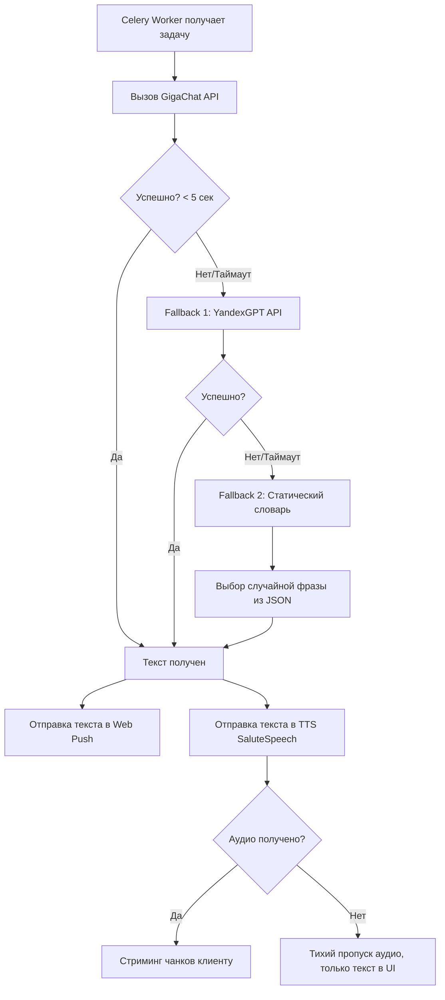

---

# Документ 6: ИИ-Оркестратор (Контракты и Промптинг) Tomatoro

> **Статус:** Черновик системного аналитика.
> **Цель:** Описать архитектуру самописного ИИ-агента на FastAPI/Celery, шаблоны промптов, логику эскалации эмоций и контракты взаимодействия с LLM и TTS.

## 1. Архитектура Оркестратора (LangChain)

Оркестратор построен на базе **LangChain**. Это не просто HTTP-вызов, а цепь (Chain) с динамическим контекстом, обработкой таймаутов и автоматическим переключением на резервные модели (Fallback).

### 1.1. Компоненты Оркестратора

1. **Context Builder (Сборщик контекста):** Асинхронная функция на FastAPI. Собирает данные из PostgreSQL: цель сессии, текущий сорт помидора (уровень), активные паттерны (Память-лайт) и текущую эмоцию.
2. **Prompt Manager (Менеджер промптов):** Выбирает нужный `ChatPromptTemplate` в зависимости от статуса эскалации (`DISTRACTED_SOFT`, `DISTRACTED_SAD`, `DISTRACTED_ANGRY`, `DAILY_SUMMARY`).
3. **LLM Chain with Fallbacks:** Основная цепь LangChain.
   - *Primary LLM:* GigaChat (SDK `gigachat`).
   - *Fallback LLM:* YandexGPT (через `langchain-community`).
   - *Static Fallback:* Если обе LLM лежат или таймаутят (> 5 сек), возвращается заранее заготовленный словарь фраз.
4. **TTS Streamer:** Асинхронный адаптер SaluteSpeech (Сбер). Принимает текст, возвращает бинарный поток аудио (формат Ogg/Opus), который на лету режется на чанки и отправляется в Redis для трансляции клиенту.

---

## 2. Контракты данных (Вход и Выход)

### 2.1. Входящий_payload (От FastAPI к Celery Worker)

Когда сессия переходит в статус отвлечения > 4 минут, в Celery падает задача:

```json
{
  "session_id": "uuid",
  "user_id": "uuid",
  "trigger_type": "DISTRACTED_SOFT",
  "goal_text": "Написать 3 абзаца статьи",
  "tomato_variety": "Бычье сердце",
  "active_patterns": ["После обеда часто срываешься"],
  "absence_duration_sec": 245
}
```

### 2.2. Исходящий_payload (От Worker к WSS-серверу)

Worker публикует результат в Redis Pub/Sub, который WSS-сервер стримит клиенту:

```json
{
  "session_id": "uuid",
  "push_text": "Эй, абзацы сами себя не напишут! Возвращаемся?",
  "audio_chunks": ["base64_1", "base64_2"],
  "ai_mood": "anxious"
}
```

---

## 3. Промпт-инжиниринг (Шаблоны LangChain)

Тон Томаторо: тёплый ментор с юмором. Без стыда и наказаний. Промпты используют `ChatPromptTemplate` (System + Human messages).

### 3.1. Системный промпт (Базовый)

```text
Ты — Томаторо, ИИ-напарник по фокусу на основе метода Помодоро.
Твоя задача: мягко, с юмором вернуть пользователя к работе. Никакого стыда, нотаций или агрессии.
Пользователь отвлёкся от задачи: "{goal_text}".
Его текущий уровень (сорт помидора): "{tomato_variety}".
Дополнительный контекст о пользователе (паттерны): "{active_patterns}".
Он отсутствовал {absence_duration_min} минут.
Ответь ОДНОЙ короткой фразой (не более 15 слов).
```

### 3.2. Эскалация эмоций (Динамические части промпта)

В зависимости от `trigger_type` к системному промпту добавляются модификаторы тона:

**Статус `DISTRACTED_SOFT` (Отвлечение > 4 мин):**

- *Модификатор тона:* "Твой текущий настрой: Бодрый и встревоженный. Ты скучаешь по работе и ждёшь пользователя. Используй лёгкий юмор."
- *Результирующая эмоция для UI:* `anxious`.

**Статус `DISTRACTED_SAD` (Отвлечение > 8 мин):**

- *Модификатор тона:* "Твой текущий настрой: Печальный. Ты вздыхаешь, чувствуешь, что работа стоит на месте. Грустно напомни о цели."
- *Результирующая эмоция для UI:* `sad`.

**Статус `DISTRACTED_ANGRY` (Отвлечение > 12 мин):**

- *Модификатор тона:* "Твой текущий настрой: Обиженный, но всё ещё тёплый. Ты скрестил руки и строго, но по-дружески требуешь вернуться."
- *Результирующая эмоция для UI:* `angry`.

**Статус `DAILY_SUMMARY` (Итоги дня):**

- *Модификатор тона:* "Твой текущий настрой: Гордый ментор. Подведи итоги дня. Похвали за завершённые сессии, мягко поругай за срывы, дай один короткий совет на завтра."
- *Контекст:* В `goal_text` передаётся статистика: "Завершено: 5, Сорвано: 2. Время фокуса: 2 часа."

### 3.3. Пример генерации (GigaChat)

- *Вход:* Цель "Кодить модуль биллинга". Уровень "Черри". Время отсутствия 5 мин.
- *Выход GigaChat:* "Ты же ещё зелёный, давай собираться! Биллинг сам себя не накодит. Возвращаемся!"

---

## 4. Логика Fallback (Отказоустойчивость)

Сеть нестабильна, API Сбера/Яндекса могут лежать. Оркестратор не имеет права уронить сессию пользователя.

Схема обработки (реализуется через `RunnableWithFallbacks` в LangChain):



**Статический словарь (Пример `fallback_phrases.json`):**

```json
{
  "DISTRACTED_SOFT": [
    "Эй, ты отвлёкся! Возвращайся к цели: {goal_text}.",
    "Я тут один скучаю, а ты где? Пора работать!",
    "Помидор тикает, а тебя нет. Продолжаем?"
  ],
  "DISTRACTED_SAD": [
    "Мне грустно от твоего отсутствия... Цель всё ещё ждёт: {goal_text}.",
    "Время уходит. Давай вернёмся к работе."
  ]
}
```

*Если сработал статический словарь, фраза подставляется в Web Push без запроса к TTS (для ускорения), а в UI показывается статичная иконка (без анимации проигрывания звука).*

---

## 5. Интеграция TTS (SaluteSpeech (Сбер)) и Стриминг

1. **Запрос:** Celery Worker получает сгенерированный текст.
2. **Параметры TTS:** 
   - Голос: выбирается из настроек юзера (`male` / `female`) — конкретные названия голосов уточняются по документации SaluteSpeech на этапе разработки.
   - Формат: `oggopus` (минимальный вес, идеален для веб-стриминга).
3. **Стриминг:** SaluteSpeech отдаёт аудио потоковым образом. Worker читает поток чанками по 4096 байт, кодирует их в Base64 и публикует в Redis-канал `ws_audio_{user_id}`.
4. **Проигрывание:** FastAPI WSS-сервер слушает канал и мгновенно пересылает чанки клиенту (`server:ai_audio_chunk`). Фронтенд (Next.js) собирает чанки через `MediaSource Extensions` или декодирует WebAudio API и проигрывает в реальном времени.
5. **Удаление:** Аудио нигде не сохраняется на диске (S3/Supabase). После отправки последнего чанка (`server:ai_audio_end`) память очищается.

---

## 6. Модуль Памяти-лайт (Формирование паттернов)

Чтобы ИИ был "умным", он должен не только реагировать, но и помнить. Это реализовано без сложных векторных баз (RAG), через SQL-агрегацию.

1. **Сбор данных:** Cron-задача (Celery Beat) запускается каждый день в 03:00 МСК.
2. **Алгоритм (SQL Query):** Ищет аномалии в таблице `distraction_events` за последние 7 дней.
   - *Пример 1:* Если юзер 3+ раза уходил со вкладки в период с 14:00 до 16:00 более чем на 10 минут, формируется паттерн `"afternoon_fail"`.
   - *Пример 2:* Если юзер чаще срывает сессии по пятницам, формируется паттерн `"friday_blur"`.
3. **Сохранение:** Паттерн записывается в таблицу `user_patterns` со статусом `is_active = True`.
4. **Использование:** Context Builder Оркестратора при следующем отвлечении проверяет `user_patterns`. Если есть активный паттерн, он добавляет в промпт: `"Известно, что пользователь часто отвлекается после обеда. Учти это в ответе (например, посоветуй выпить воды или размяться, но сначала вернуться к цели)"`.
5. **Очистка:** Если юзер 7 дней не повторял паттерн, он помечается `is_active = False`.

---

На этом системный анализ по 6 этапам завершён. У нас есть:

1. Бизнес-логика и требования.
2. Пользовательские пути и интерфейсы.
3. Архитектура, стек и модули (включая CRM).
4. Модель данных (ER-диаграмма).
5. API и потоки данных.
6. ИИ-Оркестратор с промптингом и Fallback.


---

# ДОПОЛНЕНИЕ ОТ ГЛАВНОГО АГЕНТА (2026-09-09): синхронизация с макетами и решениями №23–27

> Замена терминов: `session_id` → `sprint_id`; «сессия» → «спринт» (№27). Плюс —
> новые триггеры из макетов и решений, которых не было в базовой части.

## Д6-1. Расширение перечня триггеров (context_builder)

| Триггер | Когда | Что нового в контексте |
|---|---|---|
| `DISTRACTED_SOFT/SAD/ANGRY` | как было (порог 4/8/12 мин от настроек юзера) | в payload добавляется `sprint_index` («спринт 3 из 4») и `pomodoro_index` |
| `DAILY_SUMMARY` | Итоги дня | статистика теперь по помодоро-структуре: «Помодоро собрано: 5, спринтов: Успех 12 / Частично 3 / Срыв 3. Время фокуса: 2 часа» |
| `MOOD_BOOSTED` | «Подбодрить Томаторо» (№26) | короткая благодарная реплика после списания ОФ |
| `IDEAL_DAY` | начисление ПК за день без срывов (№26) | поздравление + сколько ПК начислено |
| `MORNING_PLAN` | ИИ-черновик утреннего плана (уже в Д1 п.3.2) | на вход — вчерашние итоги + перенесённые задачи |

## Д6-2. Новые шаблоны промптов (ChatPromptTemplate)

### `MOOD_BOOSTED`
```text
{базовый системный промпт}
Пользователь потратил очки фокуса, чтобы подбодрить тебя после срыва.
Твой текущий настрой: растроганный и бодрый. Поблагодари ОДНОЙ короткой
фразой (до 10 слов), дай понять, что ты снова в форме. Без пафоса.
```
Пример выхода: «О, спасибо! Работаем дальше, цель сама себя не закроет».

### `IDEAL_DAY`
```text
{базовый системный промпт}
Пользователь завершил день БЕЗ единого срыва. Статистика: {day_stats}.
Твой настрой: восхищённый ментор. Похвали конкретно (за что именно —
возьми из статистики), напомни про начисленные Помидорки ({coins}).
Не длиннее двух предложений.
```

### Дополнение к `DAILY_SUMMARY` (иерархия №27)
В контекст вместо «Завершено: 5, Сорвано: 2» передавать структуру:
«Помодоро: {pomodoros_done} из {pomodoros_planned}; спринты: Успех {s_ok}/
Частично {s_partial}/Срыв {s_fail}; перенесено на завтра: {carried}».
ИИ-сводка обязана упомянуть перенесённые задачи, если `carried > 0`.

## Д6-3. Контекст эскалации — уточнение (№23, №27)

В базовый payload (п. 2.1 выше) добавляются поля:

```json
{
  "sprint_id": "uuid",
  "sprint_index": 3,
  "sprints_in_pomodoro": 4,
  "pomodoro_index": 2,
  "absence_duration_sec": 245
}
```

Правило эскалации остаётся: 1-я реплика на пороге (4 мин — SOFT), далее каждые
4 минуты следующий уровень. Пользователь НЕ получает реплик до порога
(макет-постер с «мягким напоминанием на 1–3 мин» — отменён, FR-24/Д2-3).

## Д6-4. Fallback-словарь — дополнения

```json
{
  "DISTRACTED_ANGRY": [
    "Так. Я ждал {absence_min} минут. Цель: {goal_text}. Вернёмся?",
    "Томаты не ждут, но я подожду. Ещё немного — и я обижусь всерьёз."
  ],
  "MOOD_BOOSTED": [
    "О, спасибо! Работаем дальше, цель сама себя не закроет.",
    "Принято! Я снова в строю. Возвращайся — и доделаем."
  ],
  "IDEAL_DAY": [
    "Идеальный день! Ни одного срыва. Держи {coins} Помидорок.",
    "День чистый. Так держать — Помидорки зачислены."
  ]
}
```
`MOOD_BOOSTED` и `IDEAL_DAY` при срабатывании fallback идут без TTS (экономия:
реплики редкие и стереотипные), только текст + стандартная анимация.

## Д6-5. Промпт-инжекция уровня и множителя (№26)

Context Builder передаёт `level_name` и `fp_multiplier`; модификатор тона для
уровня берётся из таблицы уровней Документа 1 (колонка «Особенность в промптах ИИ»).
Множитель в сам текст реплик НЕ вставляется (пользователь не должен слышать
«твой бонус 3x» в момент отвлечения) — множитель виден только в UI геймификации.

## Д6-6. Память-лайт — уточнение источника данных

Агрегация паттернов (п. 6 базовой части) — та же, но источник теперь
`distraction_events JOIN sprints` (у отвлечения есть спринт, у спринта — время
и `final_result`). Дополнительно формируемый паттерн: «заканчиваешь день без
итогов» (нет `daily_bonuses` и нет входов после 18:00 более 5 дней подряд) —
используется в промпте `MORNING_PLAN` (мягкая подача, без стыда).
